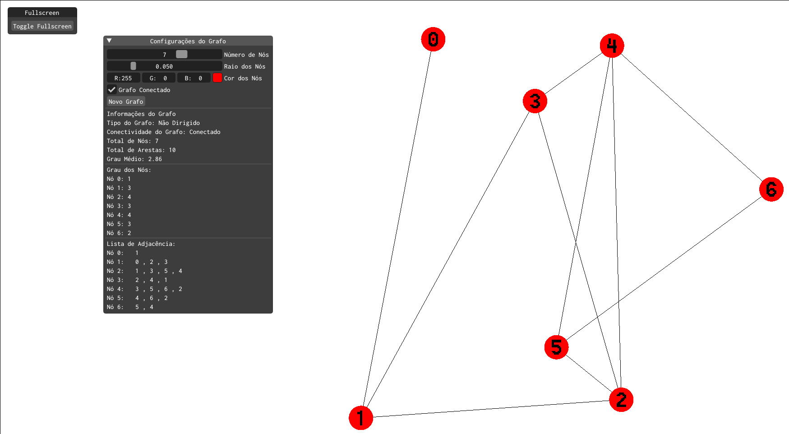

# 2DG

Autoria:
> Diego Guerra<br> 
> RA: 11201810534<br>
> Juan Oliveira de Carvalho<br> 
> RA: 11201810997<br>

## Objetivos

O objetivo deste projeto é desenvolver uma aplicação simples com gráficos 2D, utilizando-se de técnicas e bibliotecas de computação gráfica.

## Motivação

Este projeto foi desenvolvido tendo em mente qualquer pessoa estudando a área de grafos, visando fornecer uma visualização gráfica de grafos aleatórios de forma simples e rápida.

## Live demo

Uma versão compilada em WebAssembly está disponível para ser executada em qualquer navegador web neste [link](https://juanocv.github.io/2DG/graph/).

Também é possível compilar o projeto localmente, seguindo as instruções de [instalação do ABCg](https://hbatagelo.github.io/cg/config.html), clonando o repositório e executando os scripts
```build.sh``` ou ```build.bat```, caso esteja no Linux ou Windows respectivamente. Os scripts irão compilar o projeto e criar um executável no diretório ```build```.

Nos [releases](https://github.com/juanocv/2DG/releases/tag/v1.0.0) do repositório providenciamos um binário já compilado para Linux.



## Funcionalidades

É possível gerar tanto grafos **conectados** quanto **desconectados**, além de:
-  Determinar a quantidade de nós (de 1 a 10 nós)
-  Personalizar a cor de exibição dos nós
-  Escolher o raio dos nós exibidas

Também são exibidas algumas características do grafo gerado, como:
-  Grau de cada nó
-  Lista de adjascências dos nós
-  Tipo de grafo (conectado/ não conectado)
-  Total de nós
-  Total de arestas
-  Grau médio do grafo

## Implementação
A aplicação foi implementada utilizando a biblioteca [ABCg](https://github.com/hbatagelo/abcg), desenvolvida pelo professor Harlen Batagelo para o curso de Computação Gráfica na UFABC, e o pipeline gráfico do OpenGL.

## Desafios Enfrentados

#### Alinhamento dos componentes do grafo:
>   Inicialmente ao redimencionar ou executar o programa em uma resolução diferente da usada no desenvolvimento, os componentes do grafo ficavam desalinhados. Isto foi resolvido criando um shader para cada componente e os fixando na mesma posição, garantindo a exibição correta.

#### Compatibilidade com navegadores:
> Outro problema encontrado foi em relação ao WebGL em navegadores diferentes, causando inconsistências na exibição de alguns shaders, fazendo com que não fossem exibidos em navegadores como Firefox. Para resolver isto tivemos que adaptar os shaders de forma compatível com ambos os navegadores.

#### Exibição do rótulo dos nós
> Inicialmente o rótulo dos nós era exibido como texto simples, porém tivemos dificuldades para sincronizar seu posicionamento junto aos nós correspondentes (principalmente em cenários onde a janela era redimensionada), por isso tivemos que trocar o texto simples por uma fonte de bitmap no shader do texto, permitindo um melhor posicionamento e exibição em qualquer tamanho de janela.